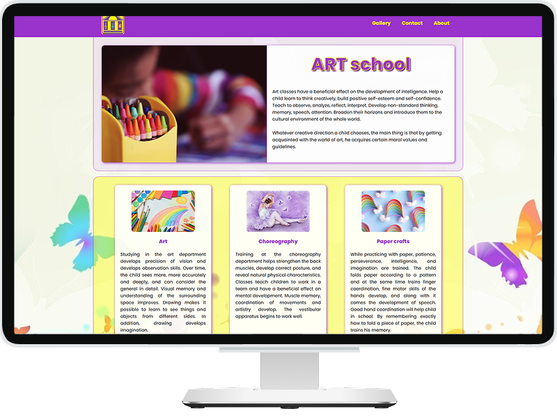

# Project name: FLEXBOX

### Project Goal:

a small project for exploring flexbox effect.

### 💎 Description

"Flexwebsite" is a colorful and well-structured example of how to built a webpage using FLEXBOX. Designed to match a given layout, it effectively manages background, opacity, text, and images for a visually appealing and responsive design.

### 🧩 Built With

<!-- end:tech-stack -->

### 🚀 <a href="https://inna-b10.github.io/Flexwebsite/" target='_blank'>View demo</a>
